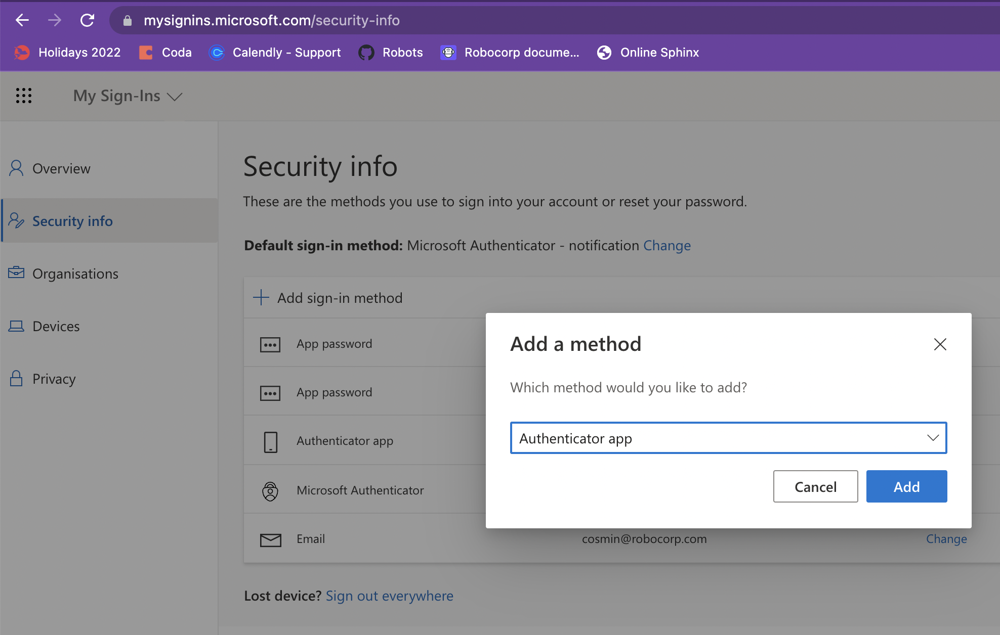
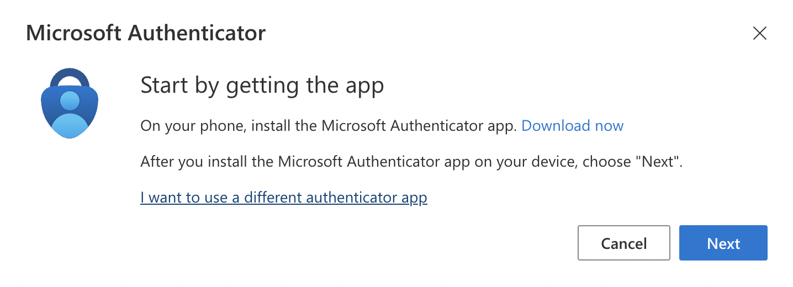
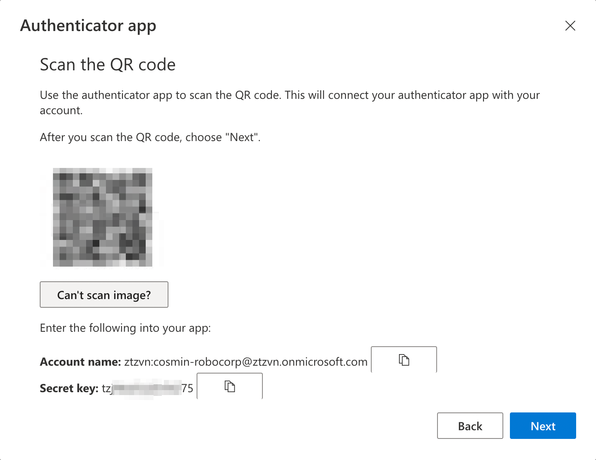
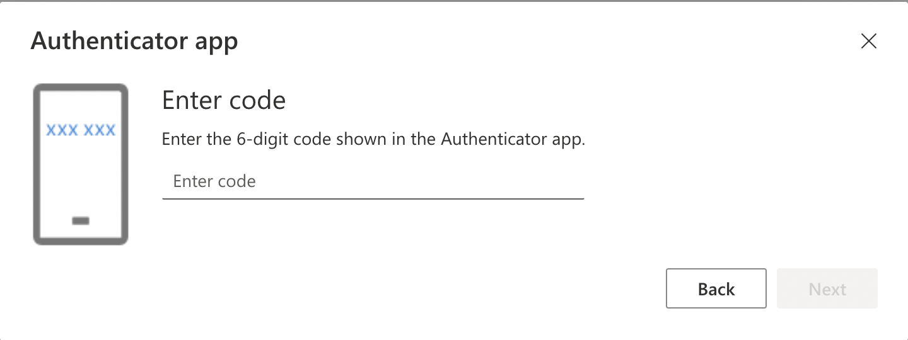

# Example of using Multi Factor Authentication with One Time Password

With `RPA.MFA` wrapping [pyotp](https://pypi.org/project/pyotp/) library, one-time
passwords can be generated automatically to sign-in into multi-factor authentication
enabled services.

The common setup flow is as follows:
1. Login into the web platform as usual, then go to security settings and register a
   new authenticator app (as you normally do with Google Authenticator or Authy).
2. Proceed through out the instructions and chose "different auth app" if such option
   is available.
3. You'll get to a QR code which contains a secret key. Obtain the secret and store
   that securely into the Vault.
   1. At the same time you can scan the QR with your mobile app so you can quickly
      finish the registration process based on the very same secret which will work in
      this robot example as well.
4. Finish registration by entering the 6-digit code obtained either with your
   smartphone or the `Get Time/Counter Based Otp` keyword. (assuming the Vault setup
   at step **3.** is already done)

Now you should be able to authenticate with your usual credentials and the immediately
requested OTP without any manual intervention, fully automated.

## Examples

### Microsoft

https://mysignins.microsoft.com/security-info

1. Add sign-in method 
2. Authenticator app 
3. QR code and secret 
4. Code confirmation 
